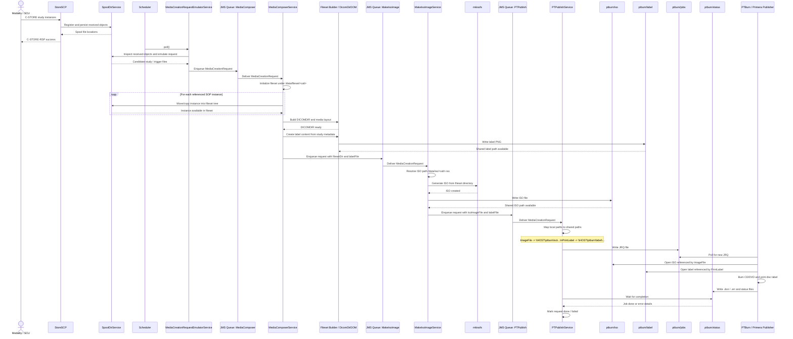
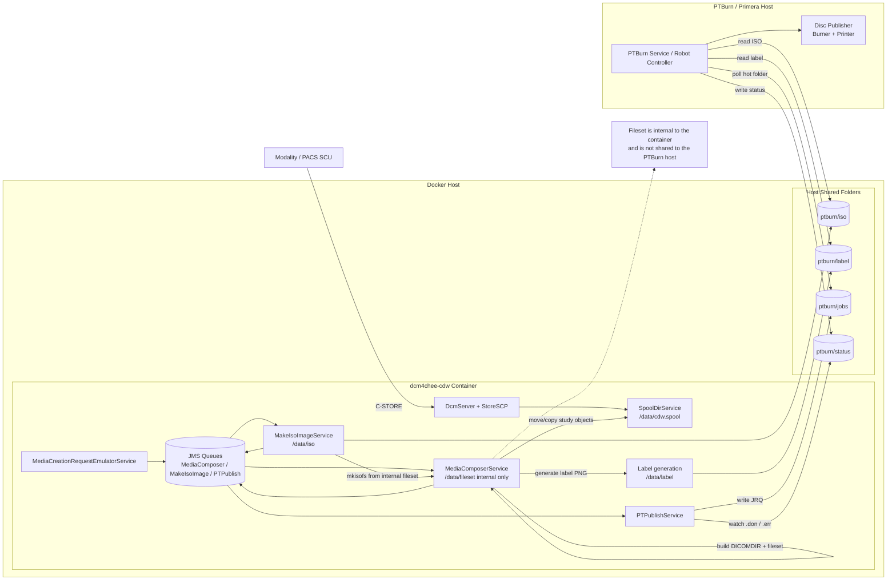

# DICOM Study to CD/DVD Publish Diagrams

This document provides a VS Code-friendly Mermaid rendering of the media creation and publishing workflow, plus a deployment view showing the container, shared folders, and PTBurn host interactions.

## Sequence Diagram



## Deployment Diagram



## Filesystem Path Mapping Diagram

```mermaid
flowchart TB
    subgraph Container[dcm4chee-cdw Container Filesystem]
        CSpool[/opt/jboss/server/default/data/cdw.spool/]
        CFileset[/opt/jboss/server/default/data/fileset/]
        CIso[/opt/jboss/server/default/data/iso/]
        CLabel[/opt/jboss/server/default/data/label/]
        CPublish[/var/lib/dcm4chee-cdw/ptburn/]
        CJobs[/var/lib/dcm4chee-cdw/ptburn/jobs/]
        CStatus[/var/lib/dcm4chee-cdw/ptburn/status/]
    end

    subgraph Host[Docker Host Paths]
        HIso[./ptburn/iso/]
        HLabel[./ptburn/label/]
        HJobs[./ptburn/jobs/]
        HStatus[./ptburn/status/]
    end

    subgraph PTBurnHost[PTBurn-visible Shared Paths]
        SIso[\\HOST\ptburn\iso\]
        SLabel[\\HOST\ptburn\label\]
        SJobs[PTBurn Job Request Folder]
        SStatus[PTBurn Status Folder]
    end

    CSpool -->|internal only| CFileset
    CFileset -->|mkisofs input| CIso
    CFileset -->|label metadata/rendering| CLabel

    CIso <-->|bind mount| HIso
    CLabel <-->|bind mount| HLabel
    CJobs <-->|bind mount| HJobs
    CStatus <-->|bind mount| HStatus

    HIso -->|shared as| SIso
    HLabel -->|shared as| SLabel
    HJobs -->|consumed by| SJobs
    HStatus -->|consumed by| SStatus

    JRQ[JRQ contents]
    JRQ -->|ImageFile| SIso
    JRQ -->|PrintLabel| SLabel

    NoteInternal[Fileset and cdw.spool remain inside the container\nso SpoolDir move operations stay on the same filesystem]
    NoteInternal -.-> CFileset

    NoteExternal[Only ISO and label artifacts are referenced in JRQ\nJobs and status remain shared for PTBurn workflow control]
    NoteExternal -.-> JRQ
```



## Notes

- The fileset directory remains internal to the container to avoid cross-filesystem move failures during media composition.
- Only the ISO and label artifacts are shared for PTBurn consumption.
- PTBurn still requires shared `jobs` and `status` folders for JRQ intake and completion signaling.
- The source PlantUML sequence version is available in [doc/dicom-study-to-cd-publish-sequence.puml](/Users/daviddavies/Downloads/dcm4chee-cdw-2.17.1-src/doc/dicom-study-to-cd-publish-sequence.puml).

## Sample JRQ Snippet

Example of the key path-mapped fields written by `PTPublishService`:

```ini
JobID = 1.2.40.0.13.1.1.1.172.19.0.2.20260627171743869.32772
ClientID = dcm4chee-cdw
Importance = NORMAL
ImageFile = \\HOST\ptburn\iso\1.2.40.0.13.1.1.1.172.19.0.2.20260627171743869.32773.iso
ImageType = MODE_1_2048
Copies = 1
VerifyDisc = YES
CloseDisc = YES
PrintLabel = \\HOST\ptburn\label\1.2.40.0.13.1.1.1.172.19.0.2.20260627171743869.32773.png
```

Path mapping intent:

- `ImageFile` points to the ISO share (`\\HOST\ptburn\iso\...`).
- `PrintLabel` points to the label share (`\\HOST\ptburn\label\...`).
- No JRQ field references the internal container fileset path.

## Sample .err Snippet

Example of a PTBurn error status file written to the shared status folder for a failed job:

```ini
JobID=1.2.40.0.13.1.1.1.172.19.0.2.20260627171743869.32772
Result=ERROR
ErrorCode=DISC_WRITE_FAILURE
ErrorText=Write verify failed at sector 183424
Timestamp=2026-06-27T17:41:53
```

Failure handling intent:

- PTBurn writes `.err` (or robot-specific status details) into the shared status folder.
- `PTPublishService` polls the status folder and treats `.err` as a failed completion.
- The media creation request is marked failed, and error details are propagated to logs/status.