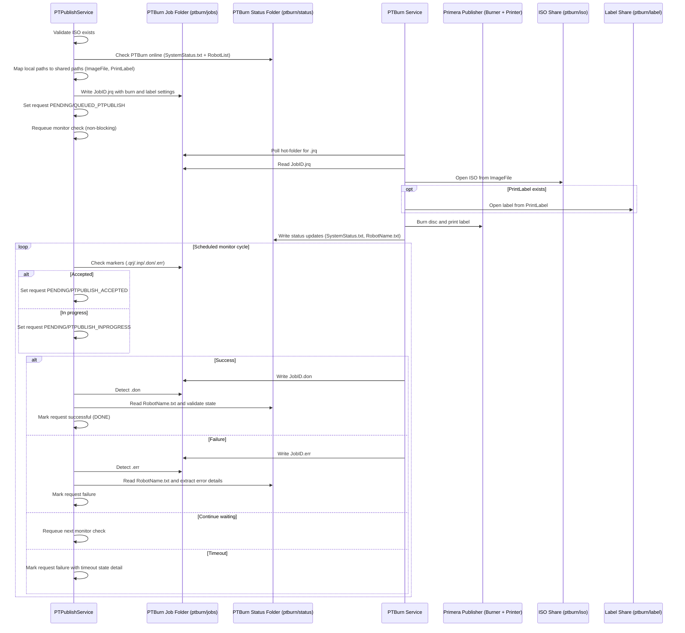

# PTPublish and PTBurn Sequence

This is the Markdown version of the focused sequence diagram for interactions between PTPublishService and PTBurn / Primera Publisher.

PlantUML source: [doc/ptpublish-ptburn-sequence.puml](/Users/daviddavies/Downloads/dcm4chee-cdw-2.17.1-src/doc/ptpublish-ptburn-sequence.puml)

For local testing without PTBurn installed, see the simulator notes in [doc/README.txt](/Users/daviddavies/Downloads/dcm4chee-cdw-2.17.1-src/doc/README.txt).

## Mermaid Sequence Diagram

